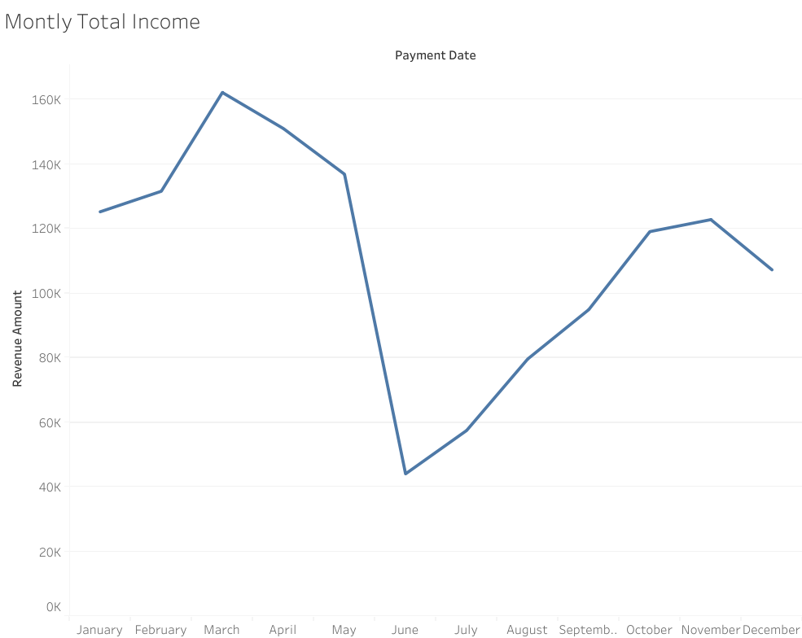
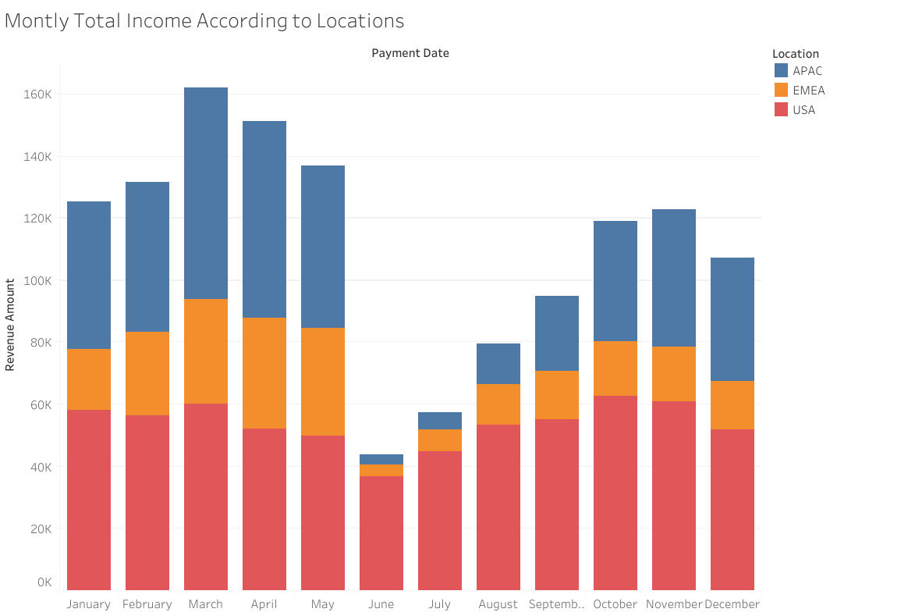
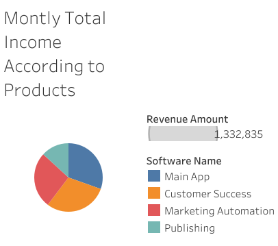

# Revenue Analysis Dashboard (Tableau)

## Overview

This dashboard analyzes revenue performance across time, locations, and product categories.

It provides insights into monthly trends, regional distribution, and product-level contribution to total revenue.

---

## Key Metrics

* Total Revenue
* Monthly Revenue Trend
* Revenue by Location
* Revenue by Product

---

## Visualizations

* Monthly revenue trend (time series)
* Revenue breakdown by location (stacked bar chart)
* Product contribution (pie chart)

---

## Line Chart Preview

---

## Stacked Bar Chart Preview

---

## Pie Chart Chart Preview

---

## Tools Used

* Tableau

---

## Key Insights

* Revenue peaked in March and dropped sharply in June
* APAC contributes the highest share in most months
* Product distribution shows dependency on a few key products

---

## Live Dashboard
[View Charts](https://public.tableau.com/app/profile/g.n.aydo.an/viz/GnAydogan-TableauHomework1-SaaSRevenueAnalysis/MontlyTotalIncome)

